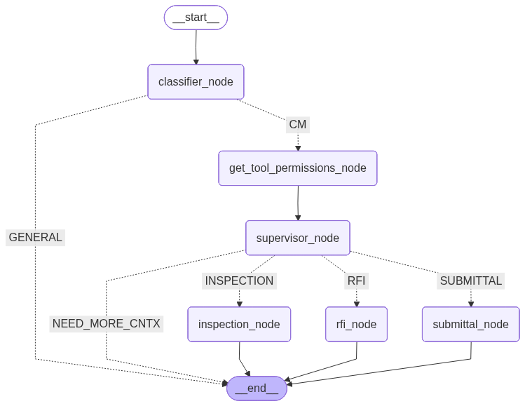

# ChatCM (Agentic Construction Management Assistant)

ChatCM is an agentic workflow that classifies user queries, checks tool permissions, retrieves structured schema knowledge, generates safe read‑only SQL, executes it, and returns concise, user‑friendly answers for Construction Management (CM) features (RFI, Submittal, Inspection).

## Architecture

High‑level LangGraph workflow (auto‑generated):



Flow:
1. `classifier_node` → Classify query as CM / GENERAL via [`QuestionClassifier`](agents/question_classifier.py).
2. If CM → `get_tool_permissions_node` loads user tool permissions.
3. `supervisor_node` ([`CMSupervisor`](agents/cm_supervisor.py)) routes to RFI / SUBMITTAL / INSPECTION or returns fallback (NON_CM_TOOL / NEED_MORE_CNTX / NO_VALID).
4. Tool node (`rfi_node`, `submittal_node`, `inspection_node`) runs a 3‑step internal SQL subgraph (generate SQL → execute → answer) implemented in [`BaseToolAgent`](agents/cm_tool_agent.py) / specialized agents (`RFIAgent`, `SubmittalAgent`, `InspectionAgent`).
5. Answer returned; GENERAL or ambiguous queries end early.

## Core Components

| Responsibility | Implementation |
| -------------- | -------------- |
| Orchestration graph | [`ChatCM`](workflows/chat_cm.py)
| Query type classification | [`QuestionClassifier`](agents/question_classifier.py) |
| CM tool routing & permission gate | [`CMSupervisor`](agents/cm_supervisor.py) |
| SQL generation + execution + NL answer | [`BaseToolAgent`](agents/cm_tool_agent.py) & registered agents (`RFIAgent`, `SubmittalAgent`, `InspectionAgent`) |
| Vector retrieval (schema / docs) | [`QdrantVector`](utils/qdrant_helper.py) |
| Prompts (SQL templates) | [`prompts.py`](prompt_templates/prompts.py) |
| HTTP API | [`app/main.py`](app/main.py) |
| Streamlit demo UI | [`streamlit_app.py`](streamlit_app.py) |
| Constants / env | [`constants.py`](constants/constants.py) |

## Safety & Guardrails

- Only single read‑only `SELECT` statements accepted (validated in [`execute_query`](agents/cm_tool_agent.py)).
- LIMIT auto‑inserted / adjusted (`_check_limit`).
- Non‑SELECT or unsafe SQL rejected early.
- Answer prompt forbids leaking raw SQL, enforces factual grounding in result set.

## Vector Store (Schema Awareness)

Schema / table descriptions are embedded and stored in Qdrant (see [`QdrantVector`](utils/qdrant_helper.py)). Agents can extend retrieval to refine `table_info` beyond default tables.

## Environment

Copy sample:
```sh
cp .env.example .env
```
Key variables (see [.env.example](.env.example)):